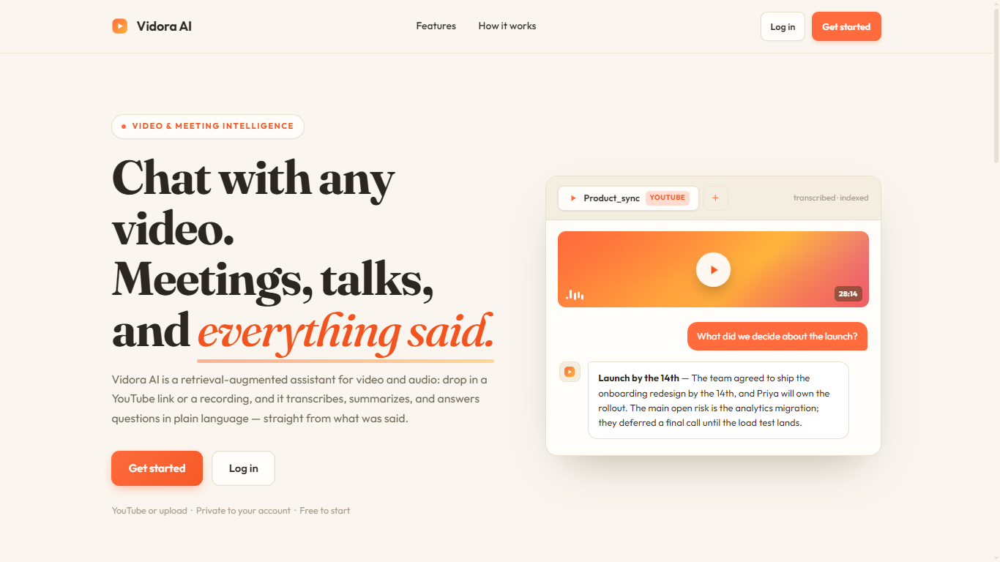
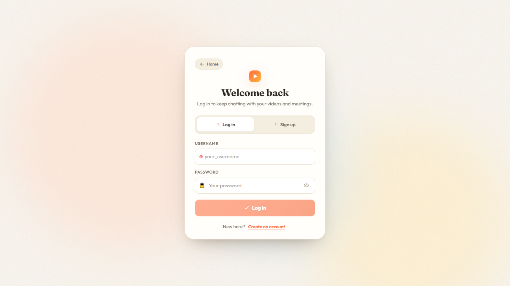
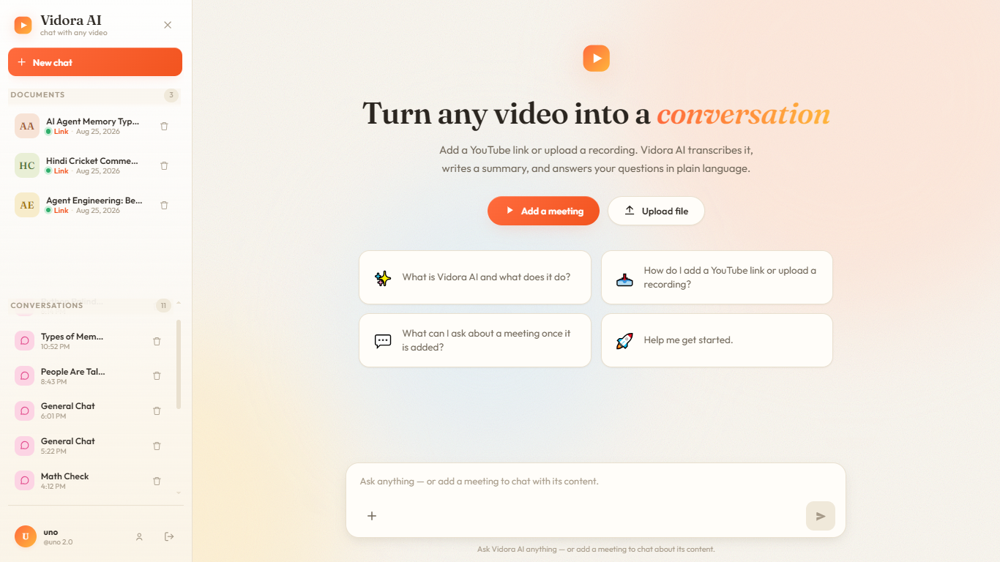

# Vidora AI

## Description

Vidora AI is a RAG-powered video and meeting intelligence assistant. Drop in a YouTube link or upload a recording — it transcribes, summarizes, extracts key insights, and lets you chat with the transcript in natural language. Every answer is grounded in what was actually said, no hallucinations, no rewatching required.

## Features

- **Chat with any video** — Paste a YouTube link or upload a recording, then ask anything in plain language. Every answer is pulled directly from the actual transcript — no guesswork, no rewatching.
- **YouTube & file upload** — Supports YouTube URLs and uploaded video/audio files.
- **Auto-transcription** — Whisper for local speech-to-text + YouTube Transcript API for captioned videos.
- **Hindi → English translation** — Automatically translates Hindi transcripts to English before indexing.
- **Smart summaries** — Generates summaries with action items, key decisions, and open questions.
- **RAG-powered chat** — Retrieval-augmented generation ensures grounded, accurate answers.
- **Streaming responses** — Real-time token-by-token streaming via SSE.
- **Conversation memory** — Full chat history preserved across sessions via LangGraph.
- **Multi-video support** — Each video gets its own vector collection for isolated retrieval.
- **User authentication** — JWT-based auth with secure password hashing.
- **Responsive UI** — Clean React + TypeScript interface with animated landing page and mobile support.

### Security & Privacy

- Your data stays **private to your account** — nothing trains on your files.
- Passwords hashed with **Argon2**, sessions secured with **JWT**.
- Per-user isolation — **no cross-account access** to any data.

## Demo

🔗 **Live App:** [https://ai-video-assistant-xi.vercel.app](https://ai-video-assistant-xi.vercel.app)

## Screenshots

### Landing Page

*Animated landing page with hero section, features overview, and how-it-works flow.*

### Login

*Secure login with JWT authentication and form validation.*

### Dashboard

*Main workspace — sidebar with meetings & conversations, chat area with streaming responses.*

